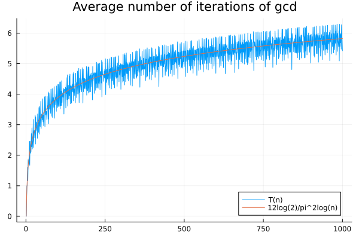
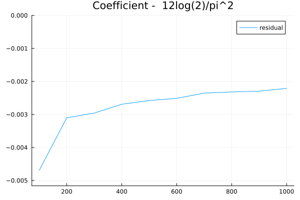

# Chapter 1.1: Euclids algorithm

## Algorithm E: Euclids algorithm for finding gcd(m,n)

Input: m, n positive integers.

* E1 [ find remainder ] r = m % n
* E2 [ is remainder zero ] r == 0 && return(n)
* E3 [ Reduce ] (m,n) = (n,r) . Goto E1

Let's implement in Julia:

``` julia
function E(m,n)
    while (r = m % n) != 0
        (m,n) = (n,r)
    end
    n
end

```

## Analysis

Knuth's goes a bit into the analysis be looking at the average number of iterations neded for a given $n$.

$T_n$: = average over all integers m > 0 of time sstep E1 of the algorithm E is performed. [p 7]


He argues that we only need to check $m <= n$, so we get the following implementation:

``` julia
function T(n0)
    i=0
    for m in 1:n0
        n = n0
        while (r = m % n) != 0
            (m,n) = (n,r)
            i = i + 1
        end
        @debug m, n, i
    end
    i/n0
end
```

He claims that asymptotically, this is $12\log(2)/\pi^2 \log(n)$.
we can check this by plotting.

``` julia
using Plots
f(n) = 12log(2)/pi^2*log(n)
n = 1000; plot([T.(1:n) f.(1:n)], label=["T(n)" "12log(2)/pi^2log(n)"], title="Average number of iterations of gcd")
```




We can also estimate it by fitting a log curve to the simulation and plot the difference between the estimated coefficient and the stated one:

``` julia
using LsqFit, Plots

model(x,p) = p[1]*log.(x)
p0 = [1.]
n = 500; f1 = curve_fit(model, 1.:n, T.(1.:n), p0)
coef(f1)[1]*pi^2/log(2)-12

function residual(n)
    model(x,p) = p[1]*log.(x)
    p0 = [1.]
    f1 = curve_fit(model, 1.:n, T.(1.:n), p0)
    coef(f1)[1] - 12log(2)/pi^2
end

plot(100:100:1000,residual.(100:100:1000), ylims=[residual(100)*1.1,0], label="residual", title="Coefficient -  12log(2)/pi^2")

```



