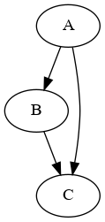

# Chapter 7. Graphs

A _graph_ consists of:

* a set of _vertices_ (no _vertex_ is repeated)
* a set of _edges_ which are unordered pairs of distinct vertices

In this definition there is at most one edge between any pair of vertexes, and no "self-edges" from one vertex to itself.

A _digraph_ consists of:

* a set of _vertexes_ as for graphs
* a "multiset" of _arcs_ which are ordered pairs of vertices

In a digraph, we can have repeated arcs and arcs from a vertex to itself.

The vertex at the end of an arc is called the _tip_.

## Adjacency matrix

The adjacency matrix of a directed graph is defined on page 19 and used on page 20.

## SGB data structure

The SGB (Stanford GraphBase) datastructure for directed graphs is defined on page 21.


### SGB digraph

A _digraph_ consists of:

* A vector of _vertex_ nodes
* An "unstructured pool" of _arch_ nodes

I choose to model the arches as dicts.

A _vertex_ consists of:

* A _name_ called NAME
* A pointer to the first ARC starting at that vertex called ARCS

When modeling arcs as Dicts, the "pointer" is the key.

An _arc_ consists of:

* The tip of the arch (end vertex) caled TIP
* A pointer to the next arc starting at the same vertex as this one or _missing_ if this is the only arch starting at this vertex, called NEXT

When modeling this as a Dict, the value of the Dict is an Int indexing the TIP in the vector of vertexes and a String which is the key of NEXT or Missing.

## Data structures and methods

I'll like to be able to convert between representations like adjaceny matrix, SGB form and other representations.

``` julia
struct AdjacencyMatrix
    A::Matrix{Int}
end
```

Implementing the SGB data structure using Dict for the arcs.

``` julia
struct Arc
    TIP::Int ## Index of end vertex
    NEXT::Union{String,Missing} ## Key of next arct starting at same node
end
struct Vertex
    NAME::String ## Name of vertex
    ARCS::Union{String, Missing} ## Key of first arc starting at this vertex
end
struct Digraph
    vertices::Vector{Vertex}
    arcs::Dict{String,Arc}
end
```

I use a "naive" graph data structure as a base case:

``` julia
struct SimpleDigraph
    name::String
    nodes::Vector{Symbol}
    arcs::Vector{Tuple{Symbol,Symbol}}
end
```

Here is how a minimal example looks:

```
A --> B --> C
L-----------^
```



In "naive" notation (note the nice "dot" function I wrote to visualize the naive graphs using GraphViz):

``` julia
g1 = SimpleDigraph("Simple", [:A, :B, :C], [(:A,:B), (:B,:C), (:A,:C)])
dot(g1,"/tmp/g1.png");
```

In SGB notation:

``` julia

g2 = Digraph(
    [Vertex("A","AB"),
     Vertex("B","BC"),
     Vertex("C", missing),
     ],
    Dict("AB"=>Arc(2,"AC"),
         "AC"=>Arc(3,missing),
         "BC"=>Arc(3,missing),
         )
)
```

# Conversion

## Digraph(g::SimpleDigraph)

It is surprisingly awkward to convert from the naive digraph to the Knuth digraph, but I currently have one that works for this example:

``` julia
julia> Digraph(SimpleDigraph("Simple", [:A, :B, :C, :D], [(:A,:B), (:B,:C), (:A,:C)]))
Digraph(
    Vertex[
        Vertex("B", "BC"),
        Vertex("A", "AB"),
        Vertex("C", missing),
        Vertex("D", missing)
    ],
    Dict{String, Arc}(
        "AC" => Arc(3, missing),
        "BC" => Arc(3, missing),
        "AB" => Arc(1, "AC")
    )
)

```

## TODO

* [X] Digraph(g::SimpleDigraph)
* [x] SimpleDigraph(Digraph)
* [ ] AdjacencyMatrix(x::Digraph)
* [ ] Digraph(x::AdjacencyMatrix)
* [ ] Algorith B (bipartate testing) p22 ff

Before the graphs there are some interesting claims about latin squares that could be nice to check.

